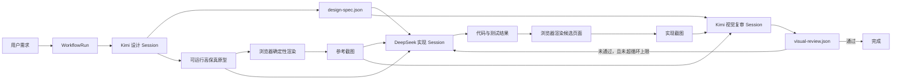

# OpenCode + Kimi + DeepSeek 多模型开发工作流

## 最新源码审计与推荐设计

日期：2026-07-29  
审计对象：`anomalyco/opencode` 默认分支 `dev`  
审计提交：`7565e03536d19e850f9996c407f9bf5e932b5f7a`  
提交时间：`2026-07-29T08:36:03Z`  
OpenCode 包版本：`1.18.9`  
最新稳定语义化标签：`v1.18.9`

## 1. 结论

这个想法可行，OpenCode 也是比 Codex 更适合作为改造底座的选择。

推荐方案不是把 Kimi、DeepSeek 的 Chat Completions 生硬伪装成真正的 OpenAI Responses，再围绕这个伪接口开发；而是：

1. 复用 OpenCode 已有的统一模型事件 `LLMEvent`。
2. 复用 V2 已有的持久 Session 输入、持久事件和可重放事件流。
3. 新增一个独立的持久 Workflow 域，负责阶段状态机、后台队列、租约、取消、重试和崩溃恢复。
4. 用不可变工件在 Kimi 设计、DeepSeek 实现、Kimi 视觉复审之间交接。
5. 等内部语义稳定后，再提供一个明确标为“兼容子集”的 Responses 风格外部接口。

这能保留 Responses 风格的主要产品体验，但不能、也不应该声称完全复刻 OpenAI 服务端内部能力。

当前源码已经解决了原计划里相当一部分基础问题：

- DeepSeek 已有原生 OpenAI-compatible Chat 路由配置。
- OpenCode 已有跨 AI SDK 和原生协议统一的 `LLMEvent`。
- V2 Session 已有持久输入 inbox、`steer`/`queue` 两种交付方式、增量持久输出和可重放事件。
- V2 已有按 Session 串行、跨 Session 并行的本地执行协调器。
- 已有请求级瞬时重试、运行中取消和进程内后台任务。

真正缺口集中在：

- 后台任务本身不持久，重启后状态丢失。
- Session 执行所有权和活动状态仍是进程内的。
- 取消没有持久取消意图，重启后不能保证继续遵守。
- 崩溃后处于“请求可能已发出、结果不确定”状态时，没有显式恢复协议。
- V2 Runner 对 MCP、插件、结构化输出、状态和重试事件仍有未完成项。
- OpenAI Responses 协议适配器只覆盖单次模型调用，不覆盖 Responses 服务端的 create/retrieve/cancel/background/resumable-stream 完整资源语义。

因此，这不是“大改模型接口”的项目，而是“在已有 V2 内核旁新增持久工作流层”的项目。

## 2. 本次审计边界

本次只做了：

- 核对当前维护仓库、默认分支、最新源码提交和最新稳定标签。
- 将最新 `dev` 源码以浅克隆方式放在 `D:\OpenCode-Audit`。
- 阅读模型协议、Provider、Session V2、事件、后台任务、Server/Protocol 和视觉测试相关源码。
- 核对 Kimi、DeepSeek、OpenAI Responses 当前官方协议文档。
- 形成设计方案和后续实施边界。

本次没有：

- 安装 Bun、Node、Playwright 或任何项目依赖。
- 请求、保存或使用 Kimi/DeepSeek API Key。
- 调用 Kimi、DeepSeek 或 OpenAI API。
- 修改任何 OpenCode 功能源码。
- 启动 OpenCode、数据库迁移或浏览器运行时。

除本文档外，工作树中的上游源码保持不变。

## 3. 关于“最新版本”

审计使用的是默认分支 `dev` 的最新 HEAD，而不是只审计发布标签：

- 默认分支：`dev`
- HEAD：`7565e03536d19e850f9996c407f9bf5e932b5f7a`
- HEAD 包版本：`1.18.9`
- 最新稳定标签：`v1.18.9`
- 稳定标签提交：`4da7bb44c84e013fa53e9c5d02ac753d1435c81a`

这意味着本文看到的 V2 Session 与 LLM 重构包含稳定标签之后的最新开发状态。它更适合做未来改造依据，但也意味着相邻 V2 API 仍可能随上游快速变化。

仓库采用 MIT License，允许修改、合并、发布和再分发，但派生版本应保留许可证和版权声明。

## 4. Kimi “高保真参考图 + 结构化规范”是否可行

可行，但需要准确区分“谁设计”和“谁生成图像文件”。

Kimi 当前 Chat Completions API 支持：

- 流式 SSE。
- 工具调用。
- 图片和视频输入。
- JSON Object 和 JSON Schema 结构化输出。
- 多轮对话。

它的标准响应仍是文本/工具调用，不是通用图片生成接口。因此推荐链路是：

1. Kimi 输出严格的 `design-spec.json`。
2. Kimi 同时生成一个可运行的高保真原型，例如 HTML/CSS/JS 或项目所用的前端组件。
3. 独立的浏览器渲染器打开原型，固定 viewport、字体、数据和动画状态。
4. 渲染器生成 desktop/mobile PNG，作为“由 Kimi 设计的高保真参考图”。
5. 人类可直接看参考图；DeepSeek 主要读取结构化规范和原型源码。

DeepSeek 当前 Chat Completions 文档中的普通 user content 是文本，不能把“只给截图”当成可靠实现输入。因此同时要求规范和原型源码不是冗余，而是保证 DeepSeek 能精确实现的关键。

在复审阶段：

1. 浏览器再次渲染 DeepSeek 的实现。
2. 把参考图、实现图、设计规范和测试结果交给 Kimi 视觉模型。
3. Kimi 输出结构化的 `visual-review.json`。
4. 若失败，只把明确问题和相关工件交回 DeepSeek，不把三个 Agent 的整段思考历史混在一起。

这满足“高保真图直观”和“规范可自动化”两种需求。

## 5. Chat Completions 与 Responses 的真实差别

| 维度 | Chat Completions | Responses |
| --- | --- | --- |
| 基本输入输出 | `messages[]` 与 `choices[].message` | 类型化 `input/output Items` |
| 流式形态 | 通常是 `choices[].delta` | 明确的生命周期事件，如 `response.created`、`response.output_text.delta`、`response.completed` |
| 对话状态 | 调用方通常维护并重传消息历史 | 可使用 `previous_response_id` 或 Conversations |
| 内置工具循环 | 通常由调用方执行工具并再次请求 | 可在一次请求中运行服务端托管的 Agent/tool loop |
| 后台任务 | Provider 通常没有统一资源语义 | `background: true`、状态轮询、retrieve、cancel |
| 断线续流 | 通常只能由应用自己重放持久结果 | 后台 Response 可用 `sequence_number` 与 `starting_after` 恢复流 |
| 内置工具 | 取决于 Provider；大多只有 function calling | Web search、file search、code interpreter、computer、MCP 等 |
| 推理上下文 | 常由应用重传，Provider 扩展不统一 | 可保存、引用或加密重放 reasoning Items |

### 5.1 为什么 Chat Completions 不会卡死整个工作流

工作流的持久化、状态机、队列、取消、重试、工件、浏览器截图和 Agent 间交接本来就应该由应用层控制，而不是依赖某一家模型 Provider。

OpenCode 已经把“Provider 单次生成”和“产品级 Session/工具循环”分开：

- 每个 Provider turn 只执行一次 `llm.stream(request)`。
- OpenCode 自己执行本地工具、保存结果、重载历史并决定是否继续下一轮。
- Kimi/DeepSeek 的 Chat 流都可被归一化成 `LLMEvent`。

所以 Chat Completions 的局限不会阻止构建这个工作流。

### 5.2 不能完全模拟的部分

以下能力只能实现“OpenCode 自己的等价语义”，不能冒充 Provider 原生语义：

- OpenAI 托管工具在 Provider 内部的一次请求多轮执行。
- OpenAI 保存的 reasoning state 和 encrypted reasoning 的完整行为。
- OpenAI Conversations/Responses 的存储、保留和数据治理语义。
- Provider 原生 `previous_response_id`。
- OpenAI 完整且随时变化的 Responses 事件类型。
- Provider 对后台推理算力、排队和超时的内部控制。

因此外部接口应标明兼容等级，而不是写“100% Responses compatible”。

## 6. 最新源码中已经存在的扩展点

### 6.1 模型事件已经统一

`packages/llm/src/schema/events.ts` 定义统一 `LLMEvent`：

- step start/finish
- text start/delta/end
- reasoning start/delta/end
- tool input start/delta/end
- tool call/result/error
- finish
- provider error

`packages/opencode/src/session/llm/ai-sdk.ts` 把 AI SDK `fullStream` 转成同一事件。

`packages/llm/src/protocols/openai-chat.ts` 和 `openai-responses.ts` 的原生协议解析器也输出同一事件。

结论：不应再新增第三套“Kimi 事件”“DeepSeek 事件”或“工作流文本流”。

正确边界是：

```text
Provider wire events
  -> Provider protocol adapter
  -> LLMEvent
  -> SessionEvent / WorkflowEvent
  -> SSE / finite history / UI
```

### 6.2 DeepSeek 已有直接路由

`packages/llm/src/providers/openai-compatible-profile.ts` 已包含：

```text
provider: deepseek
baseURL: https://api.deepseek.com/v1
```

`packages/llm/src/providers/openai-compatible.ts` 已导出 `deepseek`。

所有 OpenAI-compatible Provider 共用：

```text
POST /chat/completions
HTTP + SSE
OpenAIChat.protocol
```

因此 DeepSeek 不需要新建完整协议解析器。真正需要验证的是模型特定字段、reasoning、工具 schema 和错误样本。

### 6.3 Kimi 需要的是 Provider 配置和兼容性测试

当前原生 `@opencode-ai/llm` Provider profile 中没有专门的 Moonshot/Kimi facade，但通用 OpenAI-compatible 路由允许配置：

- Provider ID
- Base URL
- Bearer API Key
- 模型 ID
- 请求 body/header 默认值

源码已经包含 `moonshot` 工具 JSON Schema 投影，处理 Moonshot 对 `$ref`、tuple 等 JSON Schema 形态的兼容问题。

OpenAI Chat 协议适配器也已支持把 canonical media 转成 `image_url` data URL，能承接 Kimi 视觉输入。

因此第一版可以通过通用 Provider 配置接入 Kimi；专门的 Kimi facade 只用于改善默认 URL、模型兼容标记、专有参数和测试体验，不是阻塞项。

### 6.4 V2 Session 已有持久输入 inbox

`session_input` 表记录：

- 输入 ID
- Session ID
- Prompt
- `steer` 或 `queue`
- admission sequence
- promotion sequence
- 创建时间

`SessionV2.prompt()` 先持久 admission，再调用 `SessionExecution.wake()`。

这条顺序非常重要：即便 wake 只是进程内提示，用户输入本身已经安全落盘。

`steer` 在下一个安全 provider-turn 边界批量提升；`queue` 在当前 drain 将要空闲时按 FIFO 每次提升一个。

### 6.5 V2 Session 输出和事件可持久重放

EventV2 使用：

- `event_sequence`
- `event`
- aggregate ID
- 单调递增 aggregate sequence

Session 的 Prompt、Step、完整 Text、完整 Reasoning、Tool Call、Tool Progress、Tool Success/Failure、Retry、Compaction 等都有持久事件定义。

文字、reasoning 和 tool input 的 delta 是 live-only；完整 `Ended` 事件是可重放边界。

V2 Server 已提供：

- `GET /api/session/:sessionID/history`
- `GET /api/session/:sessionID/event`

后者按 durable sequence 先重放、再无竞态地 tail 新持久事件，正适合断线重连。

这也是未来 Responses 风格 `starting_after` 的最佳内部基础。

### 6.6 当前执行协调器只解决本进程并发

`SessionRunCoordinator` 的语义是：

- 同一 Session 串行。
- 不同 Session 可并行。
- `resume` 加入已有执行。
- `wake` 合并后续执行。
- `interrupt` 中断当前本地 fiber。

但是活动 Map、fiber 和 pendingWake 都在内存中。进程退出后会全部消失。

### 6.7 当前 BackgroundJob 明确不是持久任务系统

`packages/core/src/background-job.ts` 已明确声明：

- registry 是 process-local。
- 重启或 scope 关闭会丢失状态。
- live work 会被中断。
- 持久观察、重启恢复和远程 worker 需要独立设计。

它可继续服务短生命周期 UI/子 Agent 功能，但不应扩展成生产级 Workflow 存储。

### 6.8 OpenAI Responses 适配器不是 Responses 服务

`packages/llm/src/protocols/openai-responses.ts` 支持：

- Responses 请求 body 的一部分。
- HTTP SSE 与 WebSocket 路由。
- 文本、reasoning、function call、Provider-hosted tool 事件解析。
- `store`、`include` 和部分 OpenAI Provider options。

但它没有实现：

- `background`
- create 后的 Response resource 存储
- retrieve
- cancel
- `starting_after`
- App 级 Response 状态机
- Provider 无关的 Responses facade

它只负责“一次 Provider turn 的 wire protocol”，不应把工作流资源语义塞进这里。

## 7. 关键判断：目标应落在 V2，而不是继续加重旧 Session

最新版源码正在把产品核心迁往：

```text
packages/schema
  -> packages/core
  -> packages/protocol
  -> packages/server
  -> packages/client / packages/sdk-next / packages/app
```

推荐新增 Workflow 时遵守相同依赖方向。

旧 `packages/opencode/src/session/prompt.ts` 和旧 `/session/:id/message` API 仍承载大量现有功能，但新的持久语义应放在 V2 核心，必要时只做兼容桥接。

原因：

- V2 已有 Schema-first 事件和持久事件重放。
- V2 已经明确把 durable admission 与执行分开。
- V2 Server/Protocol 已有 typed API。
- 在 V1 继续堆后台状态会在迁移时重复实现。

风险是 V2 仍未完全达到 V1 parity，所以实施必须切成可独立合并的小步，不能一次性替换整个 Session runtime。

## 8. 三种改造路径

### 方案 A：只配置 Agent 和 Provider

做法：

- Kimi、DeepSeek 配为两个 Provider/模型。
- 建立 designer、implementer、reviewer 三个 Agent。
- 用 Prompt、文件和手动命令串起流程。
- 用 MCP 或脚本渲染截图。

优点：

- 最快验证 Prompt、模型能力和工件格式。
- 对上游源码改动最少。
- API 成本和失败模式容易观察。

缺点：

- 没有持久 Workflow 状态。
- 取消、重试和恢复只在 Session 或进程级。
- 人工交接多。
- 不能可靠提供 Responses 风格后台资源。

适合：一次性 PoC。

### 方案 B：在 V2 内新增持久 Workflow 域

做法：

- 复用 Session 和 EventV2。
- 新增 WorkflowRun、WorkflowStage、Artifact、Attempt/Lease。
- 用阶段状态机编排多个独立 Session。
- 用持久 worker 执行和恢复。
- 最后提供 Responses 兼容子集。

优点：

- 与最新源码方向一致。
- 状态、事件、API 和 UI 都能保持 Schema-first。
- Agent Session 仍可独立使用，不污染通用 Session 语义。
- 适合本地单机，未来也能升级为多 worker。

缺点：

- 需要新增数据库表、事件和 API。
- 必须认真处理租约、幂等和含副作用步骤的恢复。
- 要跟随 `dev` 分支持续 rebase。

适合：本项目。  
结论：推荐。

### 方案 C：外置 Temporal/LangGraph 等编排器

做法：

- OpenCode 只作为代码 Agent Server。
- 外部系统持久化状态、调度阶段并调用 OpenCode V2 API。

优点：

- 成熟的 durable workflow、retry、timer 和 worker 模型。
- OpenCode fork 更薄。
- 更适合多机器和生产服务。

缺点：

- 增加部署、鉴权和运维复杂度。
- 工件和实时事件要跨服务桥接。
- 本地桌面体验整合较差。
- 对“一个可携带的 OpenCode 平替”过重。

适合：未来多租户或集群版，而不是第一版。

## 9. 推荐架构



### 9.1 Session 与 Workflow 的职责

Session 负责：

- 一位 Agent 与一个模型的上下文。
- 单次 provider turn。
- 工具执行。
- 模型消息和 Session 事件。

Workflow 负责：

- 多个 Session 的阶段顺序。
- 每阶段输入和输出工件。
- 后台调度。
- 审批门。
- 取消、重试、租约和恢复。
- 总体预算和循环上限。

不要用一个超长 Session 同时扮演三个角色。独立 Session 加不可变工件交接能减少注意力摊薄和角色串味。

### 9.2 建议阶段

```text
brief.accept
design.spec
design.prototype
design.render
implementation.plan
implementation.execute
verification.code
implementation.render
review.visual
review.decide
complete
```

`review.decide` 可以：

- 通过。
- 要求 DeepSeek 修复后回到 `implementation.execute`。
- 要求 Kimi 修订设计后回到 `design.spec`。
- 等待人工确认。
- 在达到循环/额度上限后失败。

默认最多两轮视觉修复，防止模型来回消耗。

## 10. 工件契约

推荐的工件不是聊天文本复制，而是有版本的不可变文件。

### 10.1 `design-spec.json`

至少包含：

- `schemaVersion`
- 页面和用户目标
- 路由与页面清单
- 设计 token：颜色、字体、间距、圆角、阴影
- 响应式 breakpoint
- 组件树
- 每个组件的状态和交互
- 空、加载、错误、禁用状态
- 数据字段和 mock data
- 可访问性要求
- desktop/mobile 截图清单
- 验收标准
- 明确非目标

必须用 JSON Schema 验证；结构不合格时只让 Kimi 修复结构，不进入 DeepSeek 阶段。

### 10.2 原型工件

至少包含：

- 原型入口
- 使用的字体/图标/静态资源
- 固定 mock data
- viewport 列表
- 渲染前等待条件
- 需要隐藏的动态内容

第一版可使用独立 HTML/CSS/JS，避免让设计原型和生产框架强绑定。

### 10.3 `implementation-manifest.json`

至少包含：

- 实际修改文件
- 已实现的需求 ID
- 未实现项
- 构建/测试命令及结果
- 运行入口
- 候选截图路径
- 已知偏差

### 10.4 `visual-review.json`

至少包含：

- `verdict`: pass/fail
- `score`
- viewport
- 问题 ID
- 严重级别
- 参考区域和候选区域
- 问题类型：布局/字体/颜色/间距/内容/交互/响应式/可访问性
- 面向 DeepSeek 的可执行修复说明
- 是否必须重新截图

视觉复审必须使用结构化输出，不能只返回“看起来不错”。

## 11. 持久化模型

建议新增独立表，不扩张 `session_input`：

### `workflow_run`

- `id`
- `type`
- `status`
- `current_stage`
- `input`
- `budget`
- `cancel_requested_at`
- `created_at`
- `updated_at`
- `completed_at`
- `version`

状态建议：

```text
queued
running
waiting_approval
succeeded
failed
cancelled
```

### `workflow_stage`

- `id`
- `workflow_id`
- `stage_type`
- `ordinal`
- `status`
- `attempt`
- `max_attempts`
- `not_before`
- `lease_owner`
- `lease_expires_at`
- `session_id`
- `checkpoint`
- `idempotency_key`
- `error`
- `started_at`
- `completed_at`

状态建议：

```text
pending
leased
running
retry_wait
waiting_input
waiting_approval
succeeded
failed
cancelled
skipped
```

### `workflow_artifact`

- `id`
- `workflow_id`
- `stage_id`
- `kind`
- `uri`
- `mime`
- `sha256`
- `size`
- `metadata`
- `created_at`

文件本体放在 workspace 或专用 artifact root；数据库只存引用、hash 和元数据。

## 12. Workflow 事件

复用 EventV2 的 aggregate sequence，不另建事件总线。

建议第一版持久事件：

```text
workflow.created
workflow.started
workflow.stage.queued
workflow.stage.leased
workflow.stage.started
workflow.artifact.created
workflow.stage.retry_scheduled
workflow.stage.succeeded
workflow.stage.failed
workflow.approval.requested
workflow.approval.resolved
workflow.cancel.requested
workflow.stage.cancelled
workflow.cancelled
workflow.succeeded
workflow.failed
```

高频 token delta 不写 Workflow durable log。它仍属于 Session live stream；Workflow 只持久化阶段边界、工件和汇总。

这样既能断点恢复，也不会把数据库变成每 token 一行。

## 13. 后台队列、取消、重试和恢复

### 13.1 队列

第一版使用 SQLite 表作为事实来源：

1. Worker 扫描 `pending/retry_wait` 且 `not_before <= now` 的阶段。
2. 在事务中检查版本并获取有期限的 lease。
3. lease 成功后启动执行 fiber。
4. 内存 wake 只用于降低延迟，不能成为唯一事实来源。
5. 进程启动时扫描过期 lease 和未完成 workflow。

### 13.2 取消

取消分为两层：

1. 持久写入 `workflow.cancel.requested` 和 `cancel_requested_at`。
2. 若当前进程持有 lease，再中断本地 fiber。

Worker 在以下边界检查取消：

- Provider 请求前。
- 工具副作用前。
- 工件提交前。
- 阶段切换前。
- 重试调度前。

这样重启后仍能看到取消意图，而不是只依赖一个已经消失的 AbortController。

### 13.3 重试

分类处理：

- 429/503/504/529、临时网络失败：遵守 `Retry-After`，指数退避和抖动。
- 鉴权、余额、无效参数：不自动重试，等待用户处理。
- JSON Schema 不合格：进入同一模型的有限结构修复子阶段。
- 构建/测试失败：不是网络重试，返回 DeepSeek 修复阶段。
- 视觉不通过：不是重试同一请求，而是状态机的一次修订循环。
- 含外部副作用且结果不明：进入 `waiting_approval` 或专用 reconcile，不自动重放。

OpenCode 当前 LLM HTTP executor 已对部分 retryable 状态最多再试两次；Workflow retry 应记录“阶段失败后的新 attempt”，不能和 HTTP 内部瞬时重试混为一谈。

### 13.4 断点续跑

恢复时只信任：

- 已持久的 Workflow/Stage 状态。
- 已完成且 hash 校验通过的工件。
- Session durable history。
- 有效 lease。

每阶段声明恢复策略：

```text
restart_safe
reconcile_required
manual_required
```

生成纯文本/规范一般可重新尝试；已修改文件但未提交完整 manifest 的实现阶段需要检查工作树；部署、发送、付款等外部副作用默认不得自动重放。

## 14. 浏览器与视觉复审

OpenCode 仓库的 `packages/app/e2e` 已包含 Playwright、CDP screenshot 和视觉稳定性工具，但这些是测试基础设施，不是可直接暴露给 Agent 的产品级渲染服务。

推荐新增窄接口 `WorkflowRenderer`：

```text
render({
  entry,
  viewports,
  waitFor,
  theme,
  reducedMotion,
  outputDirectory
}) -> screenshots + diagnostics
```

实现可选择：

- 本地 Playwright worker。
- 已连接的 Browser MCP。
- 未来的远程截图服务。

第一版优先本地 worker，并固定：

- 浏览器版本。
- viewport 和 device scale factor。
- 字体。
- locale/timezone。
- reduced motion。
- mock data。
- 网络白名单。
- 等待选择器。

复用测试目录中的思路，但不要让产品代码直接 import `packages/app/e2e` 私有实现。

## 15. Responses 风格兼容层

该层放在 Workflow 稳定之后。

### 15.1 可提供的第一版子集

```text
POST /v1/responses
GET  /v1/responses/:id
POST /v1/responses/:id/cancel
GET  /v1/responses/:id?stream=true&starting_after=N
```

映射：

- `response.id` -> `workflow_run.id`
- `queued/in_progress/completed/failed/cancelled` -> Workflow status
- `output[]` -> Workflow 工件、摘要和最终消息
- `sequence_number` -> Workflow aggregate durable sequence
- `starting_after` -> EventV2 exclusive aggregate sequence
- `background: true` -> 创建后立即返回，不等待 workflow 完成
- cancel -> 持久 cancel request + 本地 interrupt

### 15.2 明确不承诺

第一版不承诺：

- OpenAI 全量事件名称和每个字段。
- OpenAI hosted tools 的同等执行环境。
- 原生 `previous_response_id` 的 Provider reasoning 延续。
- OpenAI Conversations。
- OpenAI 数据存储和保留策略。
- 所有 OpenAI SDK 高级 helper 无差异工作。

兼容接口应返回能力元数据，例如：

```text
x-opencode-responses-compat: workflow-v1
```

文档列出支持矩阵，并为不支持字段返回明确的 4xx，而不是静默忽略。

## 16. 推荐修改位置

### 只需要小改或配置

- `packages/llm/src/providers/openai-compatible-profile.ts`
  - 可选：加入 Moonshot/Kimi profile。
- Catalog/Provider 配置
  - 声明 Kimi、DeepSeek 模型、URL、兼容选项。
- Agent 配置
  - designer、implementer、reviewer。

### 新增 Workflow 核心

- `packages/schema/src/workflow-*.ts`
  - 浏览器安全的状态、事件和 API schema。
- `packages/core/src/workflow/*`
  - SQL、store、projector、scheduler、runner、recovery。
- `packages/protocol/src/groups/workflow.ts`
  - typed HTTP/SSE API。
- `packages/server/src/handlers/workflow.ts`
  - handler 和 layer 装配。
- `packages/client` / `packages/sdk-next`
  - Workflow client。
- `packages/app`
  - Workflow 时间线、审批、预算、工件和视觉对比 UI。

### 最后新增

- `packages/protocol/src/groups/responses-compat.ts`
- `packages/server/src/handlers/responses-compat.ts`

不建议：

- 把 Workflow 状态塞进 `packages/llm`。
- 把持久后台任务塞进现有 process-local `BackgroundJob`。
- 复制一套 EventV2。
- 直接把 OpenAI Responses wire event 当作内部领域事件。

## 17. 两大建设阶段

审计完成后，后续建设可收敛为两个大阶段。

### 建设阶段 A：可靠底座

包含：

- Kimi/DeepSeek Provider 接线和兼容样本。
- 统一事件边界确认；通常只补兼容字段，不新造事件总线。
- Workflow 数据表和持久事件。
- 持久队列、lease、启动恢复。
- 持久取消。
- 分类重试。
- 有限的断点续跑。
- typed Workflow API。

验收标准：

- 杀掉并重启进程后，未完成 Workflow 可恢复或明确进入人工处理。
- 同一阶段不会被两个 worker 同时执行。
- 取消在重启后仍有效。
- API Key 不进入事件、工件和日志。

估计：5–8 个集中开发日，取决于 V2 测试和迁移稳定性。

### 建设阶段 B：设计—实现—复审产品化

包含：

- Kimi 结构化设计与原型。
- 确定性浏览器渲染。
- DeepSeek 实现。
- 构建、测试和截图。
- Kimi 视觉复审。
- 修订循环、人工审批和预算。
- App 工作流 UI。
- 最后按需增加 Responses 风格兼容子集。

估计：

- 状态机、工件和视觉链路：4–7 个集中开发日。
- Responses 兼容子集：另加 2–4 个集中开发日。

整体生产级本地 MVP 应按约 2–3 周看待；只做可演示 PoC 可以显著更快，但不能同时声称具备可靠崩溃恢复。

## 18. 成本与额度控制

平台必须内建：

- Workflow 总 token 上限。
- 每阶段 token 上限。
- 最大 Provider turn。
- 最大工具调用数。
- 最大重试次数。
- 最大视觉修订轮数。
- 最大 wall-clock 时间。
- 达到 50%、80%、100% 预算时的事件和 UI 提示。
- 人工批准后才能提升预算。

推荐先用录制/回放和假 Provider 测试状态机，只有模型能力验证才用真实 API。

API Key 在建设阶段 A 的数据库和状态机开发中也不需要；等 Provider 接线集成测试时再由用户提供，并通过现有 credential/integration 边界保存，不写入仓库或 workflow 表。

## 19. 风险清单

### 高风险

- `dev` 分支 V2 仍快速变化，长时间大分支会产生高 rebase 成本。
- 含副作用步骤的模糊失败不能依靠“自动重试”解决。
- Kimi 原型、浏览器字体和生产实现若环境不同，视觉比较会产生噪声。
- DeepSeek 不直接消费参考截图时，设计规范质量决定实现保真度。

### 中风险

- SQLite lease 与长 Provider 请求需要合理续租和 fencing。
- 高频 Session delta 和 Workflow durable event 混用会造成游标语义不清。
- 上游 Provider 特有字段可能超出通用 OpenAI Chat schema。
- V2 的 MCP、插件和 structured-output parity 尚未完成。

### 可控风险

- Kimi/DeepSeek 输出 schema 偶发不合法：有限修复 + Schema validation。
- 模型反复修改：循环上限 + 人工审批。
- Token 失控：分阶段预算 + 缓存 + 工件摘要。
- 截图包含敏感数据：固定 mock data、脱敏、retention policy。

## 20. 测试策略

建设阶段 A 必须先覆盖：

- Workflow 状态转换单元测试。
- lease 竞争与过期恢复。
- cancel 的幂等性。
- retry 分类和 `Retry-After`。
- 重启恢复。
- 事件 sequence 与 replay。
- 工件 hash 和重复提交。
- API Key/Authorization 日志脱敏。

建设阶段 B 必须覆盖：

- `design-spec.json` schema。
- Kimi/DeepSeek 录制的 SSE cassette。
- 工具调用参数分片。
- reasoning/tool call/usage 兼容。
- desktop/mobile 确定性截图。
- Kimi review schema。
- 两轮修订上限。
- 人工审批和预算耗尽。

真实 API 测试只做窄样本，主状态机测试使用 deterministic fake 和 cassette，避免每次跑测试都消耗额度。

## 21. 审计证据索引

关键源码证据：

- `packages/llm/src/schema/events.ts:78-295`
  - 统一 `LLMEvent`。
- `packages/llm/src/protocols/openai-compatible-chat.ts:10-22`
  - OpenAI Chat compatible Provider 共用协议。
- `packages/llm/src/providers/openai-compatible-profile.ts:6-16`
  - DeepSeek profile。
- `packages/llm/src/providers/openai-compatible.ts:38-65`
  - Provider facade 和 DeepSeek 导出。
- `packages/llm/src/protocols/openai-chat.ts:59-107`
  - Chat 消息、图像、工具和流式 body。
- `packages/llm/src/protocols/openai-chat.ts:205-228`
  - canonical media 到 `image_url`。
- `packages/llm/src/protocols/utils/tool-schema.ts:26-45,68-85`
  - Moonshot tool schema 投影。
- `packages/llm/src/protocols/openai-responses.ts:984-1019`
  - Responses HTTP/WebSocket provider routes。
- `packages/core/src/session/sql.ts:119-165`
  - Session message 与 durable input inbox。
- `packages/core/src/session/input.ts:41-81`
  - 持久 admission。
- `packages/core/src/session/input.ts:245-287`
  - steer 和 queue promotion。
- `packages/core/src/session/run-coordinator.ts:5-103`
  - 进程内按 Session 执行协调。
- `packages/core/src/session/execution/local.ts:10-44`
  - 本地执行 ownership。
- `packages/core/src/session/runner/llm.ts:43-90`
  - 当前完成项和明确缺口。
- `packages/core/src/session/runner/llm.ts:173-345`
  - 单次 Provider turn、增量事件、工具执行与 continuation。
- `packages/core/src/session/runner/llm.ts:383-405`
  - steer/queue drain loop。
- `packages/core/src/event.ts:126-150`
  - EventV2 publish/subscribe/durable/replay API。
- `packages/core/src/event.ts:541-603`
  - 持久事件按 sequence 重放和 tail。
- `packages/schema/src/session-event.ts:197-372`
  - text/reasoning/tool 的 live/durable 边界。
- `packages/schema/src/session-event.ts:448-512`
  - Session durable 和全部事件 manifest。
- `packages/protocol/src/groups/session.ts:307-354`
  - Session history、replay-tail SSE、interrupt API。
- `packages/server/src/handlers/session.ts:333-370`
  - V2 history/events/interrupt handler。
- `packages/core/src/background-job.ts:113-120`
  - BackgroundJob 明确是 process-local、非 durable。
- `packages/core/src/background-job.ts:337-357`
  - 当前进程内 cancel。
- `specs/v2/session.md:13-50`
  - durable prompt admission 与执行分离。
- `specs/v2/session.md:153-185`
  - timeout/retry、post-crash recovery、durable replay 的当前边界。
- `specs/v2/provider-model.md:268-284`
  - V2 当前支持的 Provider 路由范围。
- `packages/app/e2e/utils/visual-stability/capture.ts:12-48`
  - 现有 CDP screenshot 测试基础。

官方协议资料：

- Kimi API 概述：<https://platform.kimi.com/docs/api/overview>
- Kimi Chat Completions：<https://platform.kimi.com/docs/api/chat>
- Kimi 工具调用：<https://platform.kimi.com/docs/guide/use-kimi-api-to-complete-tool-calls>
- Kimi 视觉模型：<https://platform.kimi.com/docs/guide/use-kimi-vision-model>
- DeepSeek Chat Completion：<https://api-docs.deepseek.com/api/create-chat-completion>
- DeepSeek Tool Calls：<https://api-docs.deepseek.com/guides/tool_calls>
- OpenAI Responses 迁移：<https://developers.openai.com/api/docs/guides/migrate-to-responses>
- OpenAI Background mode：<https://developers.openai.com/api/docs/guides/background>
- OpenAI Streaming Responses：<https://developers.openai.com/api/docs/guides/streaming-responses>

## 22. 下一步建议

在用户确认本文档后，下一步只写建设阶段 A 的可执行实施计划，不直接开始全部改造。

该计划应再切成小批：

1. Workflow schema、状态转换和数据库迁移。
2. Store、projector、lease 与 worker。
3. cancel/retry/recovery。
4. Protocol/Server API。
5. 录制/回放和崩溃测试。

每一批完成后独立验证，避免一次改动同时触碰 Provider、Session、Workflow、UI 和 Responses facade。
